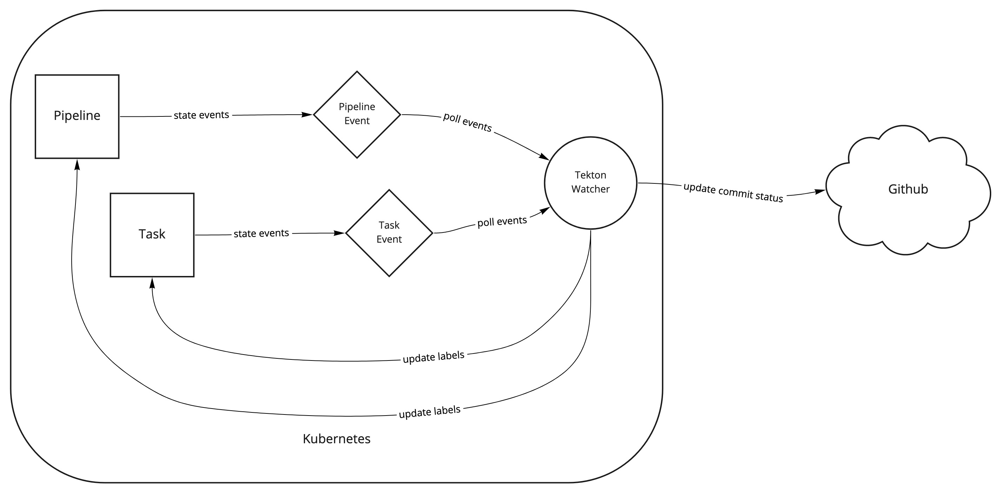

# Tekton Watcher

Tekton Watcher is a service to react to events that occur in Tekton Pipelines and Tasks.



## Installation

> To build Tekton Watcher it depends on [Vessel](https://github.com/nubank/vessel)

Update `app/*.yaml` configurations to your needs

```
make build
docker image load -i target/tekton-watcher.tar
docker image push tekton-watcher:XXX remote/tekton-watcher:XXX
kubectl apply -f app/*.yaml
```

## Configuration

| Key | Default | Description |
| - | - | - |
| `:api.server/url` | `"http://localhost:8080"` | The Kubernetes REST API endpoint |
| `:github.oauth-token/path` | `"/etc/github-statuses-updater/oauth-token"` | Path to GitHub OAuth Token |
| `:tekton/namespace` | `"default"` | Namespace where Tekton Pipelines are deployed |
| `:tekton-watcher.server/port` | `9000` | Port that Tekton Watcher expose heatlcheck in `/health/live` path |
| `:tekton.api/path` | `"/apis/tekton.dev/v1beta1"` | Tekton API version |
| `:tekton.api/url` | `"{api.server/url}{tekton.api/path}/namespaces/{tekton/namespace}"` | Kubectl proxy Tekton resources path |
| `:tekton.api.alpha/path` | `"/apis/tekton.dev/v1alpha1"` | Tekton API Alpha version |
| `:tekton.api.alpha/url` | `"{api.server/url}{tekton.api.alpha/path}/namespaces/{tekton/namespace}"` | Kubectl proxy Tekton alpha version resources path |
| `:tekton.dashboard/task-run` | `"{tekton.dashboard/url}/#/namespaces/{tekton/namespace}/taskruns/{task-run}"` | Kubectl proxy Tekton TaskRun resources path |
| `:tekton.dashboard/url` | `"http://localhost:8081"` | [Tekton Dashboard](https://github.com/tektoncd/dashboard) URL |

## Contributing

Pull requests are welcome. For major changes, please open an issue first to discuss what you would like to change.

Please make sure to update tests as appropriate.

## License
[Apache License 2.0](./LICENSE)
